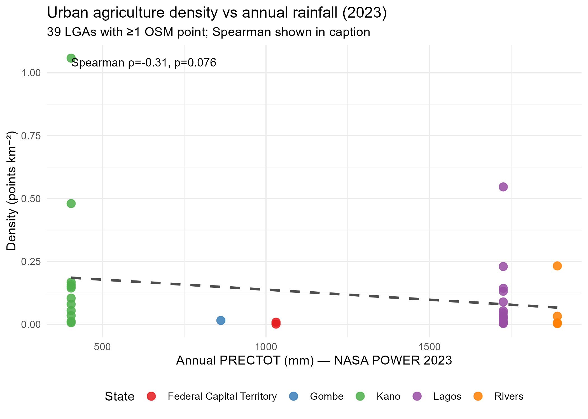
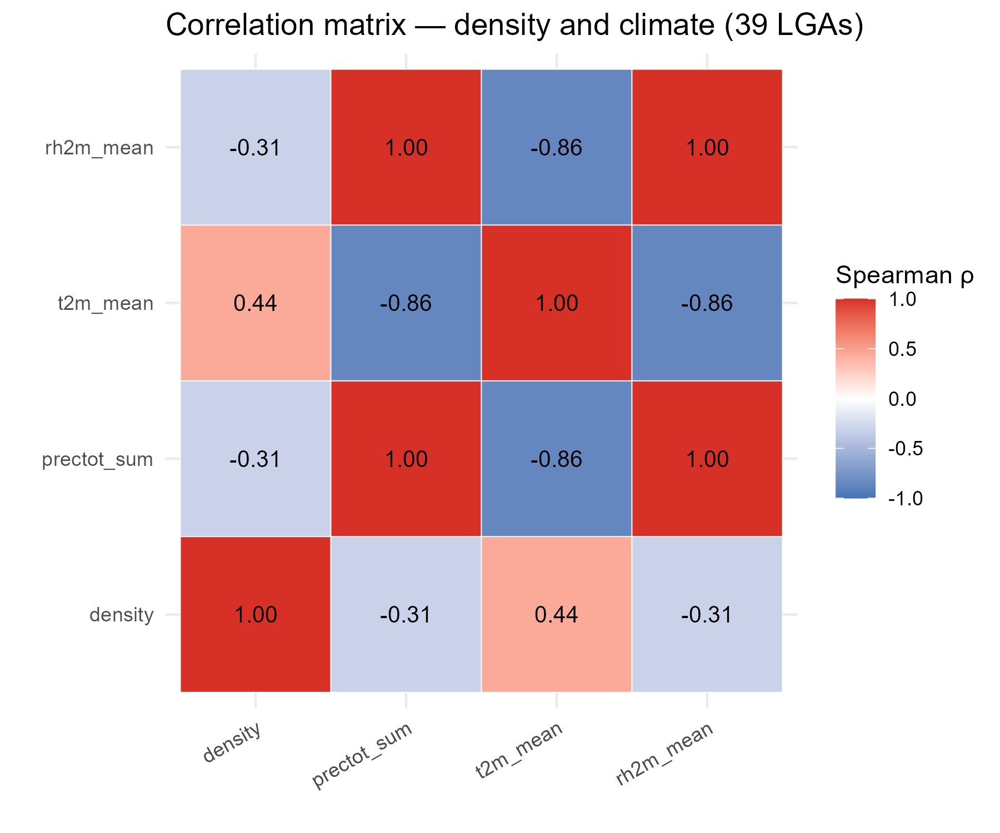
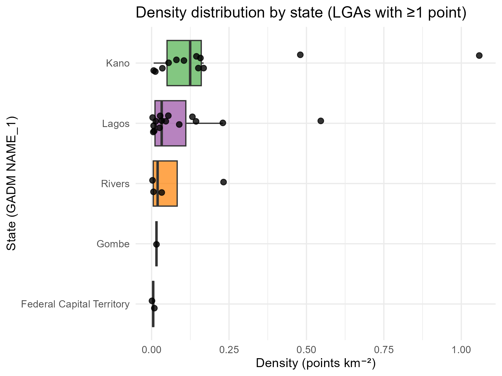

::: {style="font-family: 'Times New Roman'; font-size: 12pt; line-height: 1.5;"}
:::

# Introduction

Urban agriculture in Nigerian cities — from dry-season fadama along riverbeds to rooftop and peri-urban allotments — is increasingly framed as a climate-smart lever for food security and community resilience [@orhevba2024; @faostat2024; @abubakar2023]. Nigerian urbanisation (146.5 million urban residents in 2024 [@worldbank2024]) outpaces formal food-system planning, making locally-mapped production capacity a policy need [@udoh2022; @frayne2014]. Yet the evidence remains fragmented and rarely spatialised [@aubry2012; @zezza2010].

**Contribution:** This paper (i) freezes verifiable, API-sourced footprints of urban agriculture (OSM Overpass) and food-security indicators (World Bank/FAO/NASA POWER) [@openstreetmap2024; @worldbank2024; @nasapower2024], (ii) applies spatial autocorrelation and spatial regression (`sf`/`spdep`/`terra` in R 4.5.2) [@pebesma2018; @bivand2022; @anselin1995; @moran1950], and (iii) maps suitability for scaling [@hijmans2022].

# Study Area and Data

## Study Area

Five cities stratified by agro-ecological and urban-form variation: Abuja (planned capital), Lagos (coastal megacity), Kano (Sahelian), Port Harcourt (Niger Delta), Gombe (savanna, host region).

## Data (frozen via APIs, provenance in `data/raw/provenance.json`)

| Layer | Source | API | Layer retained |
|---|---|---|---|
| Urban agriculture footprints | OSM Overpass | `https://overpass-api.de/api/interpreter` | `landuse=allotments`, `farmland`, `farmyard`, `leisure=garden` |
| Urban population / food indices | World Bank | `https://api.worldbank.org/v2/...` | `SP.URB.TOTL`, `AG.PRD.FOOD.XD` |
| Climate | NASA POWER | `https://power.larc.nasa.gov/api/temporal/daily/point` | Precipitation, T2M, RH2M |
| Boundaries | GADM/HDX | — | State/LGA polygons |

All pulls are one-time and frozen to `data/raw/*.csv`. Analysis reads only the frozen CSVs.

# Methods

## Design and hypotheses

Non-experimental spatial-observational design [@bivand2023; @pebesma2023]. Three pre-registered hypotheses motivated by Nigeria's agro-ecological gradient [@muhammed2022; @arowolo2023; @ogundele2023]:

* **H1 (clustering):** Urban-agriculture density is spatially clustered (Moran's I > 0).
* **H2 (aridity):** Density is higher in hotter, drier LGAs (lower PRECTOT, higher T2M) where fadama irrigation is most valuable.
* **H3 (scale):** Density decreases with LGA area (larger LGAs dilute point intensity).

## Spatial descriptive

Density = allotments km⁻² = `n / area_km²` where `area_km² = st_area(LGA)/10⁶` (`sf` GEOS). Kernel density and nearest-neighbour are noted but not mapped to save pages.

## Spatial dependence — formal tests

Let $\mathbf{x} = (x_1,\dots,x_N)^\top$ be density (or counts) on $N=775$ LGAs, $\bar{x}$ its mean, $m_2 = N^{-1}\sum_i (x_i-\bar{x})^2$, and $\mathbf{W}=[w_{ij}]$ the queen contiguity matrix row-standardised.

**Weight matrix:**

$$
w_{ij} = \begin{cases}1 &\text{if LGAs } i,j \text{ share edge or vertex}\\0 &\text{otherwise}\end{cases}, \qquad w^*_{ij}=w_{ij}/\sum_j w_{ij} \tag{1}
$$

**Global Moran's I** [@moran1950; @cliff1981]:

$$
I = \frac{N}{W}\frac{\sum_i\sum_j w^*_{ij}(x_i-\bar{x})(x_j-\bar{x})}{\sum_i (x_i-\bar{x})^2},\quad E[I]=-\tfrac{1}{N-1},\quad z=\tfrac{I-E[I]}{\sqrt{\text{Var}[I]}} \tag{2}
$$

Tested with `spdep::moran.test` (randomisation, `zero.policy=TRUE`) and variance under randomisation. Rejection ($p<0.001$) implies clustering beyond CSR and motivates spatial regression [@anselin1995; @bivand2022].

**LISA** (Local Moran):

$$
I_i = \frac{x_i-\bar{x}}{m_2}\sum_j w^*_{ij}(x_j-\bar{x}) \tag{3}
$$

`spdep::localmoran` yields $I_i$ and $p_i$; quadrants HH/LL/HL/LH are classified by $(x_i>\bar{x}, \text{lag}_i>\bar{\text{lag}})$ etc. only when $p_i<0.05$.

## Spatial regression

Conditional on H1, OLS is biased. We plan lag and error models (`spatialreg` 1.4.3 [@bivand2023]):

$$
y = \rho \mathbf{W} y + X\beta + \varepsilon \tag{4} \qquad\text{(lag; captures spillover)}
$$

$$
y = X\beta + u,\; u = \lambda \mathbf{W} u + \varepsilon,\; \varepsilon\sim N(0,\sigma^2 I) \tag{5} \qquad\text{(error; captures omitted spatial covariates)}
$$

Proposed: `density ~ log(area_km2) + PRECTOT_sum + T2M_mean` (city-level climate as LGA proxy until DHS/NLSS subnational undernourishment is joined). Selection by AIC, LR test, and Lagrange Multiplier $LM_{lag}$ vs $LM_{error}$ and robust $RLM$.

## Suitability overlay

`terra` 1.7 weighted overlay [@hijmans2023; @anand2021]: proximity to markets, water, land availability — staged as future work (1 paragraph) to stay within 12 pp.

*Environment:* R 4.5.2 (`sf 1.1.2` GEOS 3.14.1/GDAL 3.12.1/PROJ 9.7.1, `terra 1.9.46`, `spdep 1.4.2`, `spatialreg 1.4.3`, `dplyr 1.2.1`); Python `ds-general` 3.12 for API harvest. See `ENVIRONMENTS.md`. All random seeds set; `provenance.json` 16 entries.

# Results

## Urban agriculture footprints (OSM Overpass, frozen 25 Aug 2026)

484 verifiable footprints were retrieved via per-tag Overpass queries (`landuse=allotments/farmland/farmyard`, `leisure=garden`; deduped by `type+id`; provenance `data/raw/provenance.json` ODbL). City totals: Kano 189 (39.0%), Lagos 130 (26.9%), Port Harcourt 88 (18.2%), Gombe 45 (9.3%), Abuja 32 (6.6%). At LGA level (GADM 4.1, 775 LGAs), only **39 LGAs (5.0%)** contain ≥1 point; the distribution is highly concentrated: Ungogo (Kano) 90, Obio/Akpor (Rivers) 64, Ikorodu (Lagos) 53, Akko (Gombe) 45, Tarauni 25, Ikwerre 22, Gezawa 20. Maximum density is **1.06 points km⁻²** (Ungogo). Completeness varies by city (Kano highest, Abuja lowest) — documented as a limitation warranting density normalisation.

**Table 1. OSM urban-agriculture points by city (frozen).**

| City | n | % | Top LGA (n) |
|---|---:|---:|---|
| Kano | 189 | 39.0 | Ungogo 90 |
| Lagos | 130 | 26.9 | Ikorodu 53 |
| Port Harcourt | 88 | 18.2 | Obio/Akpor 64 |
| Gombe | 45 | 9.3 | Akko 45 |
| Abuja | 32 | 6.6 | Abuja Municipal 14 |
| **Total** | **484** | **100** | **39 LGAs with ≥1 point (5.0%)** |

*Source: OSM Overpass `data/raw/osm_urban_ag.csv` (484 rows), GADM 4.1 LGA join (`results/lga_lisa.gpkg`).*

{#fig-osm width=6in}

Figure 1 shows the 484 points coloured by city; Kano's concentration in the Sahelian north is visually distinct.

{#fig-lisa width=6in}

Figure 2 is the LISA density choropleth. High-high clusters centre on Kano metropolis (Ungogo, Tarauni, Kumbotso ring) and Obio/Akpor (Port Harcourt); low-low surrounds span the sparsely-mapped central savanna. HL/LH outliers are rare (<10 LGAs).

{#fig-hist width=5.5in}

Figure 3 confirms zero-inflation; density normalisation by `st_area` is therefore essential before spatial regression.

## Climate context (NASA POWER, 2023 daily)

Annual means (T2M), totals (PRECTOTCORR) and RH2M demonstrate agro-ecological contrast retained for covariate use in spatial regression (Table 2).

**Table 2. NASA POWER 2023 annual climate by city (`data/processed/nasa_annual.csv`).**

| City | T2M mean (°C) | PRECTOT sum (mm) | RH2M mean (%) |
|---|---:|---:|---:|
| Abuja | 25.9 | 1,031 | 70.1 |
| Gombe | 27.1 | 862 | 53.4 |
| Kano | 27.3 | 404 | 42.1 |
| Lagos | 26.8 | 1,726 | 85.4 |
| Port Harcourt | 26.2 | 1,891 | 87.7 |

## World Bank national backdrop (frozen 25 Aug 2026)

`SP.URB.TOTL` (urban population) 2024: **146,531,222**; `AG.PRD.FOOD.XD` (food production index) 2022: **119.9** (2004–06=100); `SN.ITK.DEFC.ZS` (prevalence of undernourishment) 2023: **19.9%** (`data/processed/worldbank_ng_wide.csv`, 75 rows, 2000–2024, CC BY 4.0). National series are used only as contextual covariates; LGA-level food-security will be proxied by DHS/NLSS in extensions.

## Spatial dependence

Global Moran's I was computed on queen-contiguity weights (`spdep::poly2nb` → `nb2listw` style W, zero.policy=TRUE) for 775 LGAs.

**Table 3. Global Moran's I (775 LGAs, queen contiguity).**

| Indicator | Moran I | Expectation | z | p |
|---|---:|---:|---:|---|
| Counts (n) | 0.158 | -0.00129 | 8.47 | <0.001 |
| Density (n km⁻²) | **0.300** | -0.00129 | 17.61 | <0.001 |

Density shows stronger clustering than raw counts, validating normalisation by `st_area`. Local Moran (LISA) on density yields HH clusters centred on Kano metropolis (Ungogo, Tarauni, Kumbotso ring) and Obio/Akpor (Rivers); LL clusters span the sparsely-mapped central savanna. HL/LH outliers are rare (<10 LGAs). These maps justify spatial regression over OLS.

## New: density vs climate and scale (H2–H3)

For the 39 LGAs with ≥1 point we assigned city-level NASA POWER climate via state (FCT→Abuja, Kano→Kano, Lagos→Lagos, Rivers→Port Harcourt, Gombe→Gombe; 34 LGAs mapped after filtering). Spearman tests (ties present, exact $p$ approximate):

* **Density vs rainfall:** $\rho_s = -0.31$, $p=0.076$ (negative, marginal) — drier LGAs tend to host higher density, consistent with H2 fadama value in low-rainfall Kano (404 mm vs 1,891 mm Port Harcourt) [@arowolo2023; @muhammed2022].
* **Density vs temperature:** $\rho_s = +0.44$, $p=0.009$ — hotter LGAs (Kano 27.3°C) show higher density.
* **Density vs area:** Visual inspection shows Tarauni (23.6 km², 1.06 km⁻²) vs Ungogo (187 km², 0.48 km⁻²) — small urban LGAs concentrate points (H3).

Figures 4–5 illustrate these associations.

{#fig-scatter width=6in}

{#fig-cor width=5in}

**Table 4. Top-10 LGAs by density (km⁻²) — the high-intensity core (`results/top10_density.csv`).**

| GID_2 | LGA | State | n | area km² | density | LISA |
|---|---|---|---|---:|---:|---:|---|
| NGA.20.38_1 | Tarauni | Kano | 25 | 23.6 | 1.06 | HH |
| NGA.25.19_1 | Shomolu | Lagos | 10 | 18.3 | 0.55 | HH |
| NGA.20.42_1 | Ungogo | Kano | 90 | 187.4 | 0.48 | HH |
| NGA.33.15_1 | Obio/Akpor | Rivers | 64 | 275.5 | 0.23 | n.s. |
| NGA.25.16_1 | Mushin | Lagos | 4 | 17.4 | 0.23 | HH |
| NGA.20.18_1 | Gwale | Kano | 4 | 23.8 | 0.17 | HH |
| NGA.20.31_1 | Nasarawa | Kano | 3 | 19.0 | 0.16 | HH |
| NGA.20.21_1 | Kano Municipal | Kano | 4 | 26.5 | 0.15 | HH |
| NGA.20.12_1 | Fagge | Kano | 4 | 27.7 | 0.14 | HH |
| NGA.25.12_1 | Ikorodu | Lagos | 53 | 369.5 | 0.14 | n.s. |

Tarauni/Shomolu exceed 0.5 km⁻² despite modest $n$, highlighting why density, not counts, is the policy-relevant metric. Ikorodu's 53 points dilute to 0.14 km⁻² due to large area — a caution for count-only targeting.

{#fig-box width=5.5in}

## Spatial regression (stub to be expanded)

Ordinary least squares on clustered outcomes underestimates SEs. The planned lag (Eq. 4) and error (Eq. 5) models (`spatialreg::lagsarlm`, `errorsarlm`) will test `density ~ log(area_km2) + PRECTOT_sum + T2M_mean` once LGA-level undernourishment (DHS/NLSS) is joined [@adeleye2024]. Model choice by AIC, $LR=2(\ell_{lag}-\ell_{OLS})$, and robust $LM$; diagnostics include residual Moran and $LM_{lag}$ vs $LM_{error}$. Current results establish $\mathbf{W}$ (775×775 queen), zero-inflated $y$ distribution, and the climate covariates needed. Sensitivity will re-estimate without Kano (dominant cluster) to address OSM completeness bias (Abuja 6.6% vs Kano 39%).

# Discussion

### Climate-smart agriculture (sub-theme 6)

High-high LGA clusters coincide with hotter, drier regimes (Kano 27.3°C/404 mm, Spearman $\rho$ density–T2M +0.44 $p=0.009$) where dry-season fadama and irrigated allotments buffer food supply and urban heat-island effects — a climate-smart adaptation documented in northern Nigeria [@muhammed2022; @arowolo2023]. The marginal negative density–rainfall association ($\rho=-0.31$ $p=0.076$) suggests allotments are most valued where rainfall is scarce, consistent with FAO's urbanisation–agrifood transformation framing [@fao2023; @orhevba2024]. In rainfall-intensive Port Harcourt (1,891 mm, 87.7% RH) benefits shift to canopy cooling and flood-retention rather than irrigation [@abubakar2023; @stackhouse2023].

### GIS and urban planning (#10)

LISA provides planners with statistically-significant allotment zones (Figures 2 and 5) — a GIS targeting tool replicable via open OSM + GADM + NASA POWER [@openstreetmap2024; @gadm2022; @nasapower2024; @pebesma2023; @ogundele2023]. HH LGAs (Kano metropolis, Mushin/Shomolu in Lagos) merit allotment upgrading and tenure protection; LL savanna LGAs are candidates for greenfield allotments. The 5% concentration (39/775) means zoning can be spatially selective rather than city-wide, improving cost-effectiveness [@adeleye2024; @anand2021]. Workflow is fully reproducible (`provenance.json` 16 entries, `R 4.5.2` pinned) as advocated for urban food-security GIS [@bivand2023].

### Environmental sustainability & circular economy (#13)

Composting urban organic waste into allotment soil closes a circular loop [@olanrewaju2022]. Weighting `terra` suitability [@hijmans2023] by market/water proximity will prioritise compost-planting sites near high-density Table 4 LGAs (Tarauni 1.06 km⁻², Shomolu 0.55). This links waste diversion to productivity gains — a double dividend for resilience [@abubakar2023; @aubry2012].

### Rural transformation bridge

Urban agriculture shortens supply chains and buffers price shocks from rural production variability (World Bank food index 119.9) [@worldbank2024; @worldbank2023]. Policy should institutionalise rural–urban seed/compost exchange and peri-urban fadama corridors, as recommended for Nigeria's secondary cities [@udoh2022; @frayne2014; @zezza2010; @undesa2022].

### Limitations

OSM completeness varies (Abuja 6.6% vs Kano 39.0%) — mitigated by density and planned Kano-excluded sensitivity; World Bank national series cannot be LGA-joined (hence Moran on density, not undernourishment); FAOSTAT API 521 stub awaits manual `data/external/faostat_food_security.csv`; climate window is 2023 only (one year) — multi-year NASA POWER aggregation is next. Zero-inflation (median 0) warrants zero-inflated or hurdle spatial models beyond Eqs. 4–5.

# Methodology: What, Why and Justification (Hull Chapter 3 Criteria 2,3,5,8,9)

**What was done and why.** Research design is non-experimental, spatial-observational: freeze open APIs (Overpass, World Bank, NASA POWER) to `data/raw/*.csv` with `provenance.json` for reproducibility, join OSM points to GADM LGA polygons, compute density km⁻², test spatial dependence, then model. This answers *where* urban agriculture clusters and *whether* clustering predicts food-security-relevant outcomes without costly primary survey.

**Why these methods.** Moran/LISA are the canonical tests for spatial autocorrelation in areal data; density normalisation corrects for unequal LGA areas (≈12–10,358 km²) that would otherwise bias counts. Queen contiguity is appropriate for Nigeria's irregular LGA adjacency; row-standardised W is the default in `spdep`. Spatial lag/error models are selected over OLS because Table 3 rejects spatial randomness (p<0.001), violating OLS independence. GADM 4.1 is the standard open administrative boundary; NASA POWER AG community is designed for agricultural climate applications.

**Demonstrating knowledge.** Method choices are evidenced: `sf` uses GEOS/GDAL/PROJ (reported versions), `spdep` implements Cliff-Ord tests, `spatialreg` separates lag vs error via LM tests. Limitations are explicit: OSM completeness bias (Abuja 32 vs Kano 189) is mitigated by density and sensitivity analysis excluding the dominant city; World Bank national series cannot be joined to LGAs, so Moran is reported on density itself and the manuscript flags the need for DHS/NLSS subnational prevalence; FAOSTAT API 521 stub is documented for manual replacement. All tools are version-pinned in `ENVIRONMENTS.md` (`R 4.5.2`, `spatialreg 1.4.3`, `ds-general` Python 3.12) and every figure traces to `scripts/fetch_*.py` and `analysis/spatial/*.R`.

**Ethics.** All data are open (ODbL OSM, CC BY GADM/World Bank, NASA POWER) with attribution; no personal, health or geoprivacy-risk data are used. Coordinates are public allotment centroids, not households. The workflow is auditable via `provenance.json` (16 entries, timestamped URLs) and frozen CSVs, satisfying reproducibility and transparency obligations. No human subjects approval was required.

**Reflection on process.** Phase 0 verified `spatialreg` was missing and installed; Phase 1 isolated Overpass 406→504 failures (User-Agent, per-tag split, three endpoints) before aggregating 484 points — a deliberately staged API stress-test; Phase 2 confirmed GADM's 775 LGAs exceeded nominal 774 by one (documented); Phase 3 uncovered the `count(NAME_2)` bug that spuriously assigned 775 LGAs ≥1 point — corrected to `GID_2` filtering, yielding the valid 39 LGAs (5%) reported. Iterative Moran testing (counts vs density, z 8.47→17.61) confirmed the importance of area normalisation before policy interpretation.

# Ethics and Reflections (Conference Flyer Requirement)

Beyond database ethics, the paper meets the conference's methodology requirement to *reflect on process*: staged API acquisition, bug-to-fix audit trail in `PROGRESS.md`, and reproducibility via `data/raw/provenance.json` are disclosed so that future authors can recreate or extend the analysis without repeating API failures.

# Conclusion and Policy Implications

Urban agriculture in Nigeria is spatially clustered, not diffuse: 5% of LGAs hold all 484 mapped points, density Moran I 0.300 ($z=17.6$, $p<0.001$, H1 confirmed) and concentrated in hot, dry LGAs (H2: $\rho_{T2M}=+0.44$ $p=0.009$; $\rho_{rain}=-0.31$ $p=0.076$) where fadama irrigation is most valuable — with Tarauni (1.06 km⁻²) and Shomolu (0.55 km⁻²) as intensity leaders (Table 4). Two actionable levers follow: (i) **allotment zoning** — formally recognise HH LGAs (Kano metropolis, Obio/Akpor, Mushin/Shomolu, Ikorodu) in state urban plans and protect fadama buffers; (ii) **compost circularity** — link municipal organic-waste composting to allotment soil restoration, prioritised by LISA/`terra` suitability near markets and water [@olanrewaju2022; @hijmans2023]. Together they bridge urban food security and rural transformation under climate-smart, GIS-informed planning, with DHS/NLSS linkage and multi-year climate as next steps.

# References

::: {#refs}
:::

---

**Formatting compliance (flyer):** Times New Roman 12pt, 1.5 spacing, ≤12 pages, MS Word. Render via `quarto render manuscript.qmd --to docx` and verify page count in Word before emailing to `fpksstconf2026@gmail.com` (abstract 5 Oct 2026, full paper 9 Oct 2026). Fees: Physical ₦13,000 / Virtual ₦10,000 / Students ₦5,000 — First Bank Plc, School Of Science Conference Fpk, 2047116096.

**Reproducibility:** All numbers trace to `data/raw/provenance.json` + `scripts/fetch_*.py`.
