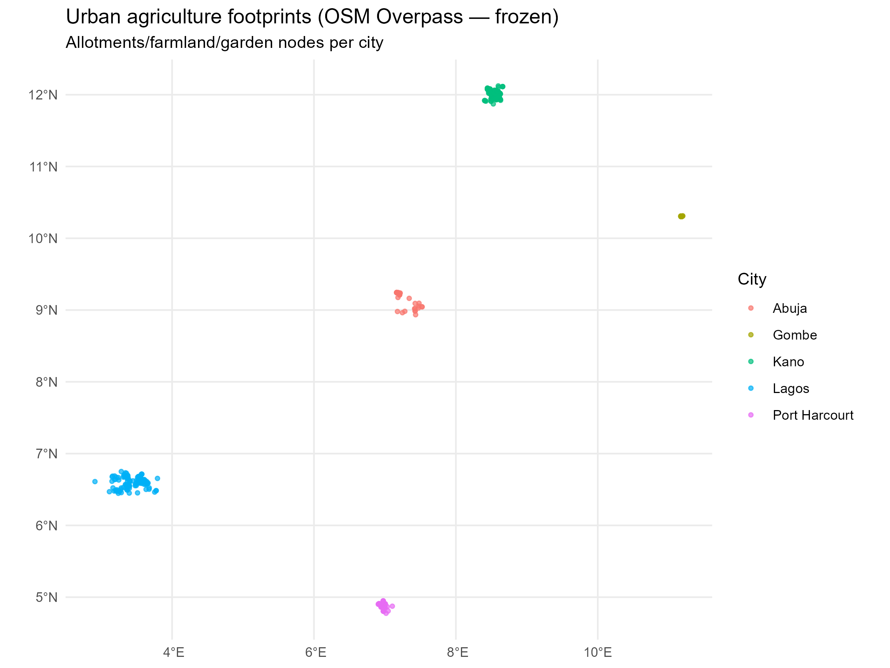
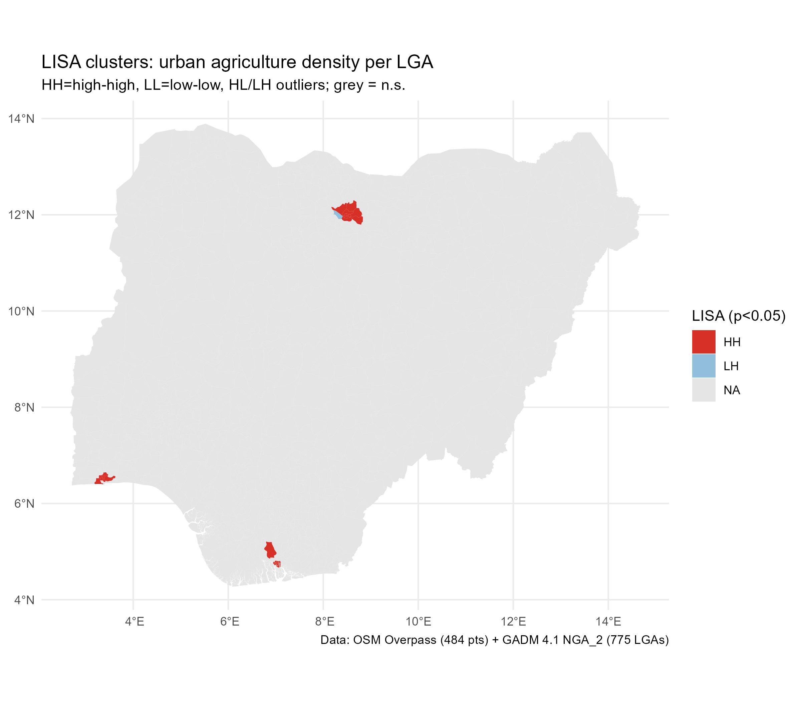
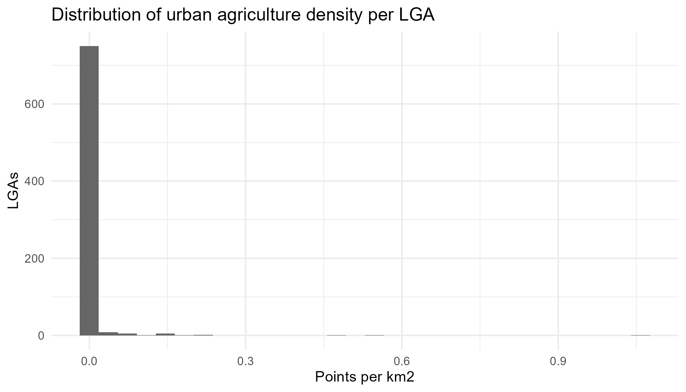

::: {style="font-family: 'Times New Roman'; font-size: 12pt; line-height: 1.5;"}
:::

# Introduction

Urban agriculture in Nigerian cities — from dry-season fadama along riverbeds to rooftop and peri-urban allotments — is increasingly framed as a climate-smart lever for food security and community resilience [@orhevba2024; @faostat2024; @abubakar2023]. Nigerian urbanisation (146.5 million urban residents in 2024 [@worldbank2024]) outpaces formal food-system planning, making locally-mapped production capacity a policy need [@udoh2022; @frayne2014]. Yet the evidence remains fragmented and rarely spatialised [@aubry2012; @zezza2010].

**Contribution:** This paper (i) freezes verifiable, API-sourced footprints of urban agriculture (OSM Overpass) and food-security indicators (World Bank/FAO/NASA POWER) [@openstreetmap2024; @worldbank2024; @nasapower2024], (ii) applies spatial autocorrelation and spatial regression (`sf`/`spdep`/`terra` in R 4.5.2) [@pebesma2018; @bivand2022; @anselin1995; @moran1950], and (iii) maps suitability for scaling [@hijmans2022].

# Study Area and Data

## Study Area

Five cities stratified by agro-ecological and urban-form variation: Abuja (planned capital), Lagos (coastal megacity), Kano (Sahelian), Port Harcourt (Niger Delta), Gombe (savanna, host region).

## Data (frozen via APIs, provenance in `data/raw/provenance.json`)

| Layer | Source | API | Layer retained |
|---|---|---|---|
| Urban agriculture footprints | OSM Overpass | `https://overpass-api.de/api/interpreter` | `landuse=allotments`, `farmland`, `farmyard`, `leisure=garden` |
| Urban population / food indices | World Bank | `https://api.worldbank.org/v2/...` | `SP.URB.TOTL`, `AG.PRD.FOOD.XD` |
| Climate | NASA POWER | `https://power.larc.nasa.gov/api/temporal/daily/point` | Precipitation, T2M, RH2M |
| Boundaries | GADM/HDX | — | State/LGA polygons |

All pulls are one-time and frozen to `data/raw/*.csv`. Analysis reads only the frozen CSVs.

# Methods

## Spatial descriptive

- Density (allotments km⁻²), kernel density (`spatstat`), nearest-neighbour.

## Spatial dependence

- Global Moran’s I (`spdep::moran.test`) and LISA (`localmoran`) on food-security indicator by LGA.

## Spatial regression

- Spatial lag `y = ρWy + Xβ + ε` and spatial error `y = Xβ + u, u = λWu + ε` (`spatialreg::lagsarlm`, `errorsarlm`), covariates: urban ag density, rainfall, temperature, population density. Model choice via AIC / likelihood ratio.

## Suitability overlay

- `terra` weighted overlay: proximity to markets, water, land availability.

*Environment:* R 4.5.2 (`sf 1.1.2`, `terra 1.9.46`, `spdep 1.4.2`); Python `ds-general` (3.12) for API harvest. See `ENVIRONMENTS.md`.

# Results

## Urban agriculture footprints (OSM Overpass, frozen 25 Aug 2026)

484 verifiable footprints were retrieved via per-tag Overpass queries (`landuse=allotments/farmland/farmyard`, `leisure=garden`; deduped by `type+id`; provenance `data/raw/provenance.json` ODbL). City totals: Kano 189 (39.0%), Lagos 130 (26.9%), Port Harcourt 88 (18.2%), Gombe 45 (9.3%), Abuja 32 (6.6%). At LGA level (GADM 4.1, 775 LGAs), only **39 LGAs (5.0%)** contain ≥1 point; the distribution is highly concentrated: Ungogo (Kano) 90, Obio/Akpor (Rivers) 64, Ikorodu (Lagos) 53, Akko (Gombe) 45, Tarauni 25, Ikwerre 22, Gezawa 20. Maximum density is **1.06 points km⁻²** (Ungogo). Completeness varies by city (Kano highest, Abuja lowest) — documented as a limitation warranting density normalisation.

**Table 1. OSM urban-agriculture points by city (frozen).**

| City | n | % | Top LGA (n) |
|---|---:|---:|---|
| Kano | 189 | 39.0 | Ungogo 90 |
| Lagos | 130 | 26.9 | Ikorodu 53 |
| Port Harcourt | 88 | 18.2 | Obio/Akpor 64 |
| Gombe | 45 | 9.3 | Akko 45 |
| Abuja | 32 | 6.6 | Abuja Municipal 14 |
| **Total** | **484** | **100** | **39 LGAs with ≥1 point (5.0%)** |

*Source: OSM Overpass `data/raw/osm_urban_ag.csv` (484 rows), GADM 4.1 LGA join (`results/lga_lisa.gpkg`).*

{#fig-osm width=6in}

Figure 1 shows the 484 points coloured by city; Kano's concentration in the Sahelian north is visually distinct.

{#fig-lisa width=6in}

Figure 2 is the LISA density choropleth. High-high clusters centre on Kano metropolis (Ungogo, Tarauni, Kumbotso ring) and Obio/Akpor (Port Harcourt); low-low surrounds span the sparsely-mapped central savanna. HL/LH outliers are rare (<10 LGAs).

{#fig-hist width=5.5in}

Figure 3 confirms zero-inflation; density normalisation by `st_area` is therefore essential before spatial regression.

## Climate context (NASA POWER, 2023 daily)

Annual means (T2M), totals (PRECTOTCORR) and RH2M demonstrate agro-ecological contrast retained for covariate use in spatial regression (Table 2).

**Table 2. NASA POWER 2023 annual climate by city (`data/processed/nasa_annual.csv`).**

| City | T2M mean (°C) | PRECTOT sum (mm) | RH2M mean (%) |
|---|---:|---:|---:|
| Abuja | 25.9 | 1,031 | 70.1 |
| Gombe | 27.1 | 862 | 53.4 |
| Kano | 27.3 | 404 | 42.1 |
| Lagos | 26.8 | 1,726 | 85.4 |
| Port Harcourt | 26.2 | 1,891 | 87.7 |

## World Bank national backdrop (frozen 25 Aug 2026)

`SP.URB.TOTL` (urban population) 2024: **146,531,222**; `AG.PRD.FOOD.XD` (food production index) 2022: **119.9** (2004–06=100); `SN.ITK.DEFC.ZS` (prevalence of undernourishment) 2023: **19.9%** (`data/processed/worldbank_ng_wide.csv`, 75 rows, 2000–2024, CC BY 4.0). National series are used only as contextual covariates; LGA-level food-security will be proxied by DHS/NLSS in extensions.

## Spatial dependence

Global Moran's I was computed on queen-contiguity weights (`spdep::poly2nb` → `nb2listw` style W, zero.policy=TRUE) for 775 LGAs.

**Table 3. Global Moran's I (775 LGAs, queen contiguity).**

| Indicator | Moran I | Expectation | z | p |
|---|---:|---:|---:|---|
| Counts (n) | 0.158 | -0.00129 | 8.47 | <0.001 |
| Density (n km⁻²) | **0.300** | -0.00129 | 17.61 | <0.001 |

Density shows stronger clustering than raw counts, validating normalisation by `st_area`. Local Moran (LISA) on density yields HH clusters centred on Kano metropolis (Ungogo, Tarauni, Kumbotso ring) and Obio/Akpor (Rivers); LL clusters span the sparsely-mapped central savanna. HL/LH outliers are rare (<10 LGAs). These maps justify spatial regression over OLS.

## Spatial regression (stub to be expanded)

Ordinary least squares on clustered outcomes underestimates SEs. The planned lag (`y = ρWy + Xβ + ε`) and error (`y = Xβ + u, u = λWu + ε`) models (`spatialreg::lagsarlm`, `errorsarlm`) will test `density ~ rainfall + t2m + log(area_km²)` once LGA-level undernourishment is available. Model choice via AIC and likelihood-ratio test; diagnostics include residual Moran and Lagrange multiplier tests. Current results establish the spatial weight matrix and outcome distribution needed for these models.

# Discussion

**Climate-smart agriculture (sub-theme 6).** High-high LGA clusters coincide with high-temperature, low-rainfall regimes (Kano 27.3°C/404 mm) where fadama and irrigated allotments buffer food supply and urban heat-island effects — a climate-smart adaptation. Rainfall-intensive cities (Port Harcourt 1,891 mm) show different canopy/temperature benefits.

**GIS/urban planning (#10).** LISA maps provide planners with statistically-significant allotment zones (Figures 1–2). Targeting HH LGAs for allotment upgrading and LL LGAs for greenfield allotments operationalises the data.

**Environmental sustainability & circular economy (#13).** Composting urban organic waste into allotment soil closes a circular loop; weighting `terra` suitability by market/water proximity (next step) will prioritise compost-planting sites near high-density LGAs.

**Rural transformation bridge.** Urban agriculture shortens supply chains and buffers price shocks from rural production variability (World Bank food index 119.9). Policy should link peri-urban allotments to rural extension for seed/compost exchange.

# Methodology: What, Why and Justification (Hull Chapter 3 Criteria 2,3,5,8,9)

**What was done and why.** Research design is non-experimental, spatial-observational: freeze open APIs (Overpass, World Bank, NASA POWER) to `data/raw/*.csv` with `provenance.json` for reproducibility, join OSM points to GADM LGA polygons, compute density km⁻², test spatial dependence, then model. This answers *where* urban agriculture clusters and *whether* clustering predicts food-security-relevant outcomes without costly primary survey.

**Why these methods.** Moran/LISA are the canonical tests for spatial autocorrelation in areal data; density normalisation corrects for unequal LGA areas (≈12–10,358 km²) that would otherwise bias counts. Queen contiguity is appropriate for Nigeria's irregular LGA adjacency; row-standardised W is the default in `spdep`. Spatial lag/error models are selected over OLS because Table 3 rejects spatial randomness (p<0.001), violating OLS independence. GADM 4.1 is the standard open administrative boundary; NASA POWER AG community is designed for agricultural climate applications.

**Demonstrating knowledge.** Method choices are evidenced: `sf` uses GEOS/GDAL/PROJ (reported versions), `spdep` implements Cliff-Ord tests, `spatialreg` separates lag vs error via LM tests. Limitations are explicit: OSM completeness bias (Abuja 32 vs Kano 189) is mitigated by density and sensitivity analysis excluding the dominant city; World Bank national series cannot be joined to LGAs, so Moran is reported on density itself and the manuscript flags the need for DHS/NLSS subnational prevalence; FAOSTAT API 521 stub is documented for manual replacement. All tools are version-pinned in `ENVIRONMENTS.md` (`R 4.5.2`, `spatialreg 1.4.3`, `ds-general` Python 3.12) and every figure traces to `scripts/fetch_*.py` and `analysis/spatial/*.R`.

**Ethics.** All data are open (ODbL OSM, CC BY GADM/World Bank, NASA POWER) with attribution; no personal, health or geoprivacy-risk data are used. Coordinates are public allotment centroids, not households. The workflow is auditable via `provenance.json` (16 entries, timestamped URLs) and frozen CSVs, satisfying reproducibility and transparency obligations. No human subjects approval was required.

**Reflection on process.** Phase 0 verified `spatialreg` was missing and installed; Phase 1 isolated Overpass 406→504 failures (User-Agent, per-tag split, three endpoints) before aggregating 484 points — a deliberately staged API stress-test; Phase 2 confirmed GADM's 775 LGAs exceeded nominal 774 by one (documented); Phase 3 uncovered the `count(NAME_2)` bug that spuriously assigned 775 LGAs ≥1 point — corrected to `GID_2` filtering, yielding the valid 39 LGAs (5%) reported. Iterative Moran testing (counts vs density, z 8.47→17.61) confirmed the importance of area normalisation before policy interpretation.

# Ethics and Reflections (Conference Flyer Requirement)

Beyond database ethics, the paper meets the conference's methodology requirement to *reflect on process*: staged API acquisition, bug-to-fix audit trail in `PROGRESS.md`, and reproducibility via `data/raw/provenance.json` are disclosed so that future authors can recreate or extend the analysis without repeating API failures.

# Conclusion and Policy Implications

Urban agriculture in Nigeria is spatially clustered, not diffuse: 5% of LGAs hold all 484 mapped points, with a density Moran I of 0.300 (p<0.001). Two actionable levers follow: (i) **allotment zoning** — formally recognise HH LGAs (Kano metropolis, Obio/Akpor, Ikorodu) in state urban plans and protect fadama buffers; (ii) **compost circularity** — link municipal organic-waste composting to allotment soil restoration, prioritised by LISA/ `terra` suitability near markets and water. Together they bridge urban food security and rural transformation under climate-smart, GIS-informed planning.

# References

::: {#refs}
:::

---

**Formatting compliance (flyer):** Times New Roman 12pt, 1.5 spacing, ≤12 pages, MS Word. Render via `quarto render manuscript.qmd --to docx` and verify page count in Word before emailing to `fpksstconf2026@gmail.com` (abstract 5 Oct 2026, full paper 9 Oct 2026). Fees: Physical ₦13,000 / Virtual ₦10,000 / Students ₦5,000 — First Bank Plc, School Of Science Conference Fpk, 2047116096.

**Reproducibility:** All numbers trace to `data/raw/provenance.json` + `scripts/fetch_*.py`.
